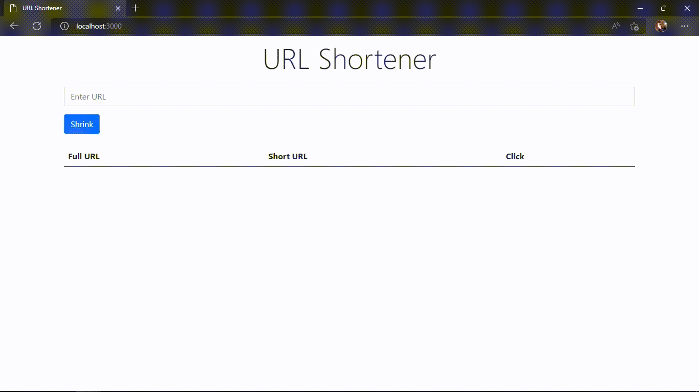

# URL Shortener

URL Shortener built with Express.js & MongoDB

## Demo

<span style="background: black"></span>

## Usage

- Clone the repo

```
$ git clone https://github.com/br4hmm/url-shortener.git

$ cd url-shortener
```

- Install dependencies

```
$ npm install
```

- Add your port & MongoDB connection string on `.env.exmaple` and change file name to `.env`

- Start the server

```
$ npm start
```

_Enjoy 😊_
